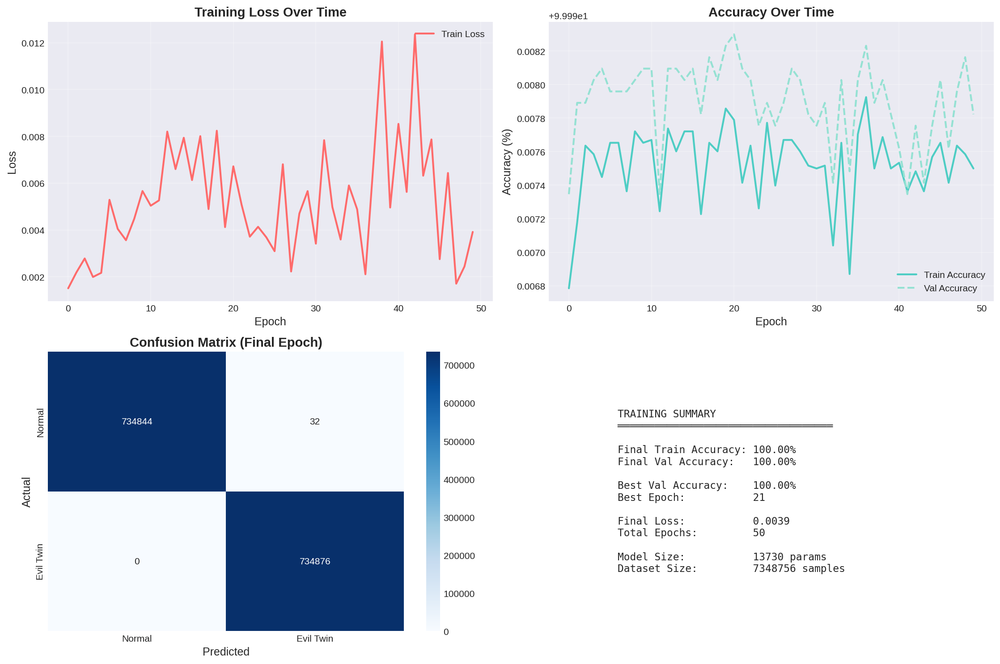

# AI-WIDS Live Demo Evidence

## Hardware Setup

| Device | Role | Config |
|--------|------|--------|
| Ubiquiti U6+ (OpenWrt) | Packet sniffer | `192.168.32.55`, monitor mode `phy0-mon0` |
| Linux Mint Server | Detection server | `192.168.32.10` |
| AP Phone | Legitimate AP | Hotspot: `FreeWiFi`, Channel 1, 2.4 GHz |
| ET Phone | Evil Twin AP | Hotspot: `FreeWiFi`, Channel 1, 2.4 GHz |
| Phone A / Phone B | Victim clients | Connect to `FreeWiFi` |

## Network Diagram

```
OpenWrt Router (192.168.32.55)
  ↓ phy0-mon0 monitor mode
  ↓ tcpdump SSH stream
Linux Mint Server (192.168.32.10)
  └── live_detection.py → http://localhost:5000

AP Phone ──── "FreeWiFi" Ch1 2.4GHz ──── Phone A (victim)
ET Phone ──── "FreeWiFi" Ch1 2.4GHz ──── Phone B (victim)
             (same SSID = Evil Twin)
```

## Full Workflow

### Step 1 — Capture Normal Traffic
```bash
chmod +x scripts/*.sh
./scripts/normal_traffic.sh
```
Produces: `data/raw/normal/*.pcap`

### Step 2 — Capture Evil Twin Attack Traffic
```bash
./scripts/evil_twin.traffic.sh
```
Produces: `data/raw/attack/*.pcap`

### Step 3 — Capture Deauth Attack Traffic
```bash
./scripts/deauth_traffic.sh
```
Produces: `data/raw/deauth/*.pcap`

### Step 4 — Extract Features
```bash
cd src
python extract_features.py
```
Produces: `data/processed/Features.csv`, `data/processed/Features_sample.csv`

### Step 5 — Train Model
```bash
python train_model.py
```
Produces:
- `data/models/wireless_ids.pt`
- `results/training_dashboard.png`
- `results/classification_report.txt`
- `results/metrics_summary.txt`
- `results/cross_validation.txt`

### Step 6 — Live Detection
```bash
python live_detection.py
```
Dashboard: `http://localhost:5000`

## Performance Results

See `results/metrics_summary.txt` and `results/classification_report.txt` for full evaluation.

| Metric | Value |
|--------|-------|
| Accuracy | See classification_report.txt |
| ROC-AUC (macro) | See metrics_summary.txt |
| CV Accuracy (5-fold) | See cross_validation.txt |
| Classes | Normal, Evil Twin, Deauth |
| Detection latency | <50ms per packet |

## Training Dashboard



## Attacks Detected

| Attack | Method | Detection |
|--------|--------|-----------|
| Evil Twin | Same SSID on multiple BSSIDs | SSID conflict (deterministic) + ML |
| Evil Twin | ML inference on beacon features | ML_EVIL_TWIN alert |
| Deauth / DoS | High deauth frame rate | ML_DEAUTH alert |
| Mobile Hotspot | OUI / randomised MAC | MOBILE_HOTSPOT flag |
