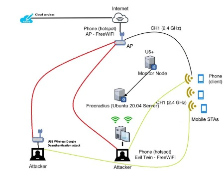

# AI-WIDS Evil Twin Detection System

## Complete Production Implementation

## Network Architecture

```
U6+ OpenWrt Router (192.168.32.55)
  ↓ br-lan (monitor mode)
Linux Mint Server (192.168.32.10)
  ├── data/raw/normal/*.pcap
  ├── data/raw/attack/eviltwin/*.pcap
  ├── data/raw/attack/deauth/*.pcap
  ├── data/processed/Features.csv
  └── data/model/wireless_ids.pt
```
### System Diagram



## 📋 Exact File Structure 

```
ai-wids-eviltwin/
├── scripts/
│   ├── normal_traffic.sh      # ./normal_traffic.sh
│   └── evil_twin.traffic.sh   # ./evil_twin.traffic.sh
├── src/
│   ├── extract_features.py    # ./extract_features.py
│   ├── train_model.py         # ./train_model.py
│   └── live_detection.py      # ./live_detection.py
├── data/
│   ├── raw/normal/            # Normal PCAPs
│   ├── raw/attack/            # Evil Twin PCAPs
│   ├── processed/             # Features.csv
│   └── model/                 # wireless_ids.pt
└── README.md                  # This file
```

## 🚀 Deployment Workflow

### 1. Data Collection

```bash
./normal_traffic.sh            # Normal traffic from U6+
./evil_twin.traffic.sh         # Evil Twin attack traffic
```

**Outputs:**

```bash
data/raw/normal/*.pcap         # Normal captures
data/raw/attack/*.pcap         # Evil Twin captures
```

### 2. Feature Extraction

```bash
python src/extract_features.py \
  --normal-dir data/raw/normal \
  --evil-twin-dir data/raw/attack/eviltwin \
  --deauth-dir data/raw/attack/deauth \
  --output data/processed/Features.csv \
  --target-ssid FreeWiFi
```

**Output:**

```
data/processed/Features.csv
```

### 3. Model Training

```bash
python train_model.py               # Deep NN training
```

**Output:**

```bash
data/model/wireless_ids.pt     # Trained model
```

### 4. Live Detection

```bash
python live_detection.py            # Real-time detection
```

**Loads:** `data/model/wireless_ids.pt`

---

## 📱 Evil Twin Attack Setup

### Legitimate AP (AP Phone):

- Hotspot: **FreeWiFi**
- Channel: **1 (2.4GHz)**
- Clients: Phone A/B connect

### Evil Twin AP (ET Phone):

- Hotspot: **FreeWiFi** (same SSID)
- Channel: **1 (2.4GHz)**
- Clients: Phone A/B switch between APs

### U6+ Capture:

```
OpenWrt: 192.168.32.55
Interface: br-lan (monitor)
Channels: 1 (2.4GHz), 2 (5GHz)
tcpdump → Server 192.168.32.10
```

---

## 🔧 Features (AWID3-style + Evil Twin)

**23 Features Extracted:**

```
wlan.fc.type, wlan.fc.subtype, wlan.sa, wlan.ta, wlan.ra, wlan.seq,
wlan.fc.ds, wlan.fc.protected, wlan.fc.moredata, wlan.fc.frag, wlan.fc.retry, wlan.fc.pwrmgt,
radiotap.length, radiotap.datarate, radiotap.timestamp.ts, radiotap.mactime,
wlan_radio.signal_dbm, radiotap.channel.flags.ofdm, radiotap.channel.flags.cck,
frame.len, wlan.reason, wlan.da_is_broadcast
label (normal-0/evil_twin-1/deauth-2)
```

---

## 📊 Expected Results

### Training Output:

```
Epoch 50: Loss 0.0234, Acc 97.5%
Model saved: data/model/wireless_ids.pt
```

### Live Detection:

```
[EVIL TWIN] Conf: 0.96 | Deauth: 1 | Beacon: 0
[EVIL TWIN] Conf: 0.98 | Deauth: 0 | Beacon: 1
[NORMAL] Conf: 0.97 | Deauth: 0 | Beacon: 0
```

---

## 🛠 Quick Deployment

```bash
# 1. Setup U6+ OpenWrt (192.168.32.55)
ssh root@192.168.32.55 "opkg update && opkg install tcpdump"

# 2. Setup phones
# AP Phone: FreeWiFi hotspot (Ch1)
# ET Phone: FreeWiFi hotspot (Ch1)
# Phone A/B: Connect to FreeWiFi

# 3. Collect data
./normal_traffic.sh
./evil_twin.traffic.sh

# 4. Train & detect
python src/extract_features.py --normal-dir data/raw/normal --evil-twin-dir data/raw/attack/eviltwin --deauth-dir data/raw/attack/deauth --output data/processed/Features.csv --target-ssid FreeWiFi
python src/train_model.py
python src/live_detection.py
```

---

